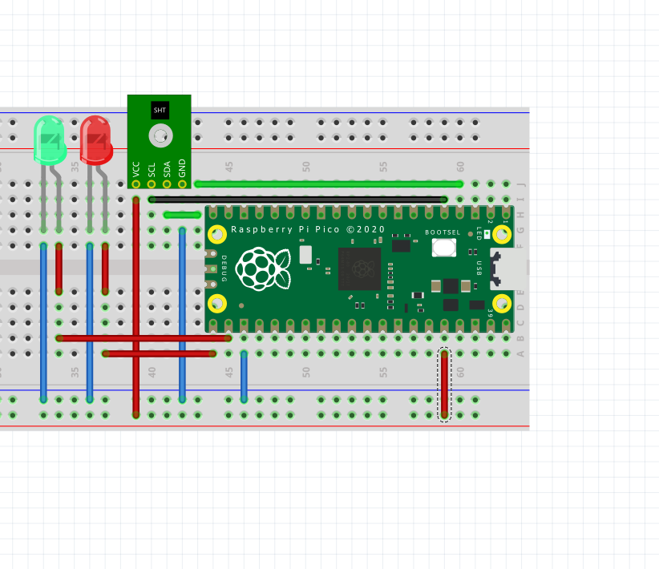

# Raspberry Pi Pico SHT20 Driver

A lightweight **MicroPython** driver for the **Sensirion SHT20** temperature and humidity sensor, designed for the **Raspberry Pi Pico** family (RP2040 and RP2350).

The driver is simple to use and includes an example (`sensor.py`) that demonstrates reading sensor data and optionally transmitting it over UART.

> **Note**
>
> This driver was developed and tested with the **SHT20** sensor. It may also work with other sensors in the **SHT2x** family (such as the SHT21 and SHT25), but these have not been tested.

---

## Features

* 🌡 Reads temperature from an SHT20 sensor.
* 💧 Reads relative humidity from an SHT20 sensor.
* 📡 Uses the I²C interface.
* 🔄 Optional UART (`TX`/`RX`) output for sending sensor readings to another microcontroller or serial device.
* ⚡ Lightweight and easy to integrate into MicroPython projects.
* 📖 Includes a ready-to-run example (`sensor.py`).

---

## Supported Hardware

### Boards

* Raspberry Pi Pico
* Raspberry Pi Pico W
* RP2350-based boards running MicroPython

### Sensor

* ✅ Sensirion SHT20

---

## Installation

1. Download this repository.
2. Copy `sht20.py` to your Raspberry Pi Pico.
3. Copy `sensor.py` to your Pico.
4. Wire the sensor as shown below.
5. Run `sensor.py`.

---

## Wiring

---

## UART Support

The example program can optionally send temperature and humidity readings over UART.

This is useful for:

* Arduino
* Another Raspberry Pi Pico
* USB-to-Serial adapters
* Any compatible serial device

---

> [!WARNING]
> **YOU MUST USE A PROPER LOGIC LEVEL SHIFTER (OR ANOTHER SAFE VOLTAGE TRANSLATION METHOD) WHEN CONNECTING A RASPBERRY PI PICO TO ANY 5 V DEVICE. FAILURE TO DO SO MAY PERMANENTLY DAMAGE YOUR HARDWARE.**
>
> **THIS SOFTWARE IS PROVIDED "AS IS", WITHOUT WARRANTIES OR CONDITIONS OF ANY KIND, AS DESCRIBED IN THE APACHE LICENSE 2.0.**
>
> **THE AUTHOR PROVIDES NO GUARANTEE THAT THIS SOFTWARE IS SUITABLE FOR YOUR APPLICATION. YOU ARE SOLELY RESPONSIBLE FOR VERIFYING YOUR WIRING, VOLTAGE LEVELS, AND THE SAFE OPERATION OF YOUR HARDWARE.**
>
> **THE AUTHOR SHALL NOT BE HELD RESPONSIBLE FOR ANY DAMAGE, DATA LOSS, HARDWARE FAILURE, OR ANY OTHER ISSUES RESULTING FROM THE USE OR MISUSE OF THIS SOFTWARE.**

---

## License

This project is licensed under the **Apache License 2.0**.

See the `LICENSE` file for details.
